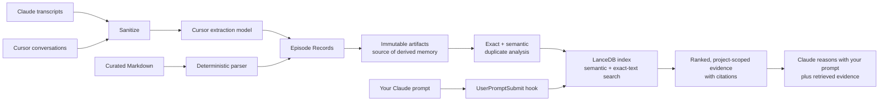

# Memento

Memento is a local, evidence-backed knowledge system for AI-assisted work. It
turns Claude Code sessions, Cursor conversations, and curated Markdown into
structured Episode Records, stores immutable source-linked artifacts, builds a
hybrid search index, and gives relevant evidence to Claude before it responds.

Everything stays on your computer except extraction: by default, Memento asks
the Cursor agent and its configured model to turn sanitized conversations into
structured records. LanceDB and FastEmbed perform storage and retrieval
locally.

## Table of contents

- [Concept map](#concept-map)
- [Requirements](#requirements)
- [1. Install Memento](#1-install-memento)
- [2. Configure Memento](#2-configure-memento)
- [3. Put knowledge into Memento](#3-put-knowledge-into-memento)
  - [Import Claude sessions](#import-claude-sessions)
  - [Import Cursor conversations](#import-cursor-conversations)
  - [Understand batch-import results](#understand-batch-import-results)
  - [Recover blocked sessions](#recover-blocked-sessions)
  - [Import a curated Markdown knowledge base](#import-a-curated-markdown-knowledge-base)
  - [Import RAW knowledge sources](#import-raw-knowledge-sources)
  - [Import a Confluence page by URL](#import-a-confluence-page-by-url)
  - [Import one transcript manually](#import-one-transcript-manually)
- [4. Test retrieval](#4-test-retrieval)
- [5. Connect Memento to Claude Code](#5-connect-memento-to-claude-code)
- [Everyday command reference](#everyday-command-reference)
- [How records are treated](#how-records-are-treated)
- [Improve the knowledge base](#improve-the-knowledge-base)
- [Troubleshooting](#troubleshooting)
- [Development](#development)

## Concept map



The original transcript or document remains the authority. Artifacts preserve
structured records and citations. LanceDB is a disposable index that can be
rebuilt with `memento ingest`.

## Requirements

- macOS or another Unix-like environment
- Python 3.12 or 3.13
- [uv](https://docs.astral.sh/uv/) for installation
- `cursor-agent` installed and authenticated for conversation extraction
- Claude Code if you want automatic prompt-time retrieval

Confirm the external commands are available:

```sh
uv --version
cursor-agent --help
claude --version
```

## 1. Install Memento

Clone the repository, enter it, and install the command as an editable uv tool:

```sh
git clone https://github.com/ianhandley-lvt/memento.git
cd memento
uv tool install --editable .
```

Confirm installation:

```sh
memento --help
```

If your shell cannot find `memento`, add uv's tool directory to your `PATH`.
With direnv, put this in the repository's `.envrc` instead of `.zshrc`:

```sh
PATH_add "$HOME/.local/bin"
```

Then approve it once:

```sh
direnv allow
```
## 2. Configure Memento

Create `~/.config/memento/config.toml`:

```toml
operator_id = "your-name"
artifacts = "/Users/you/.local/share/memento/artifacts"
database = "/Users/you/.local/share/memento/lancedb"

[extractor]
provider = "cursor"
mode = "ask"
model = "gemini-3.7-flash-low"
max_sanitized_chars = 500000

[projects.my-project]
root = "/Users/you/src/work/my-project"

[projects.another-project]
root = "/Users/you/src/personal/another-project"
knowledge_base = "/Users/you/knowledge/another-project/Wiki"
```

Use any stable name for each project table, such as `lvcore`. `root` is the
local repository directory. `knowledge_base` is optional.

You can register projects without editing TOML by hand. From anywhere inside a
Git repository, this finds its root and uses the directory name as the project
ID:

```sh
memento config add-project
```

Register a specific directory, or override its inferred ID:

```sh
memento config add-project ~/src/work/lvcore
memento config add-project ~/src/work/schedule-management-service --id schedule-service
```

The command preserves the existing config file, refuses conflicting IDs or
roots, and reports `already_registered` when the same project is added again.

Create the storage directories and inspect the single global configuration:

```sh
mkdir -p ~/.local/share/memento/artifacts ~/.local/share/memento/lancedb
memento config show
```

`config show` lists every registered project. To see which project Memento
resolves from the directory you are currently in, run:

```sh
memento config current
```

Configuration precedence is command option, `MEMENTO_*` environment variable,
TOML value, then built-in default. `MEMORY_*`/`SESSION_RAG_*` variables and the
old config paths remain fallback compatibility mechanisms.

## 3. Put knowledge into Memento

### Preview first

Extraction uses Cursor model quota. A dry run discovers candidates without
calling the model:

```sh
memento import-sessions --source claude --all-projects --dry-run
memento import-sessions --source claude --project my-project --dry-run
memento import-sessions --source claude --project current --dry-run
memento import-sessions --source cursor --dry-run
```

### Import Claude sessions

Import every transcript belonging to configured projects:

```sh
memento import-sessions --source claude --all-projects
```

Limit the import to one project or recent sessions:

```sh
memento import-sessions --source claude --project my-project
memento import-sessions --source claude --project current
memento import-sessions --source claude --project my-project --since 2026-09-01
```

Claude imports always require an explicit project scope. `--project current`
uses the registered project containing the current directory; it fails clearly
when the directory is not inside one. `--all-projects` imports every registered
Claude project.

To retry recorded extraction failures without retrying everything:

```sh
memento import-sessions --source claude --project my-project --resume
```

If a failed transcript changed afterward, Memento reports
`changed_since_failure` instead of silently retrying different content. Run a
normal import to treat the changed file as a new revision.

For the newest Claude session in the project you are currently inside:

```sh
cd /Users/you/src/work/my-project
memento capture --latest
```

This extracts the session and rebuilds the index in one operation.

### Import Cursor conversations

```sh
memento import-sessions --source cursor --dry-run
memento import-sessions --source cursor
```

Memento reads a temporary, read-only snapshot of Cursor's local conversation
search database and ignores duplicate cloud-cache rows. Cursor does not expose
a trustworthy project path there, so these records are deliberately unscoped.
They appear only in searches that explicitly use `--global-scope`.

There is intentionally no `--source all` command. Claude imports are
project-scoped while Cursor imports are global and unscoped, so combining them
made discovery totals misleading. Run the two explicit commands separately.

### Understand batch-import results

`import-sessions` prints one JSON summary for the run. For example:

```json
{
  "discovered": 178,
  "eligible": 101,
  "activated": 100,
  "unchanged": 77,
  "changed_since_failure": 0,
  "blocked": 1,
  "failed": 0,
  "pending_retry": 0,
  "indexed": 386,
  "exact_duplicates": 0,
  "possible_duplicates": 16,
  "attention_required": [
    {
      "source_type": "claude_session",
      "source_id": "example-session-id",
      "status": "blocked",
      "reason": "Sanitized session exceeds the configured character limit",
      "next_action": "resolve the stated reason, then use --resume if the source is unchanged; use a normal import if it changes"
    }
  ]
}
```

The source-processing fields count sessions or conversations:

| Field | Meaning |
| --- | --- |
| `discovered` | Source sessions found after applying the source, project, and `--since` filters. |
| `eligible` | Discovered sources selected for processing in this run. Normally this excludes sources whose current content hash already has an artifact. With `--resume`, it includes only retryable unchanged revisions. |
| `activated` | Eligible sources successfully extracted or restored from an existing artifact and made the active revision. This counts sources, not Episode Records. |
| `unchanged` | Sources skipped because an artifact for the same content already exists, plus any eligible source that resolves to a no-op. |
| `changed_since_failure` | During `--resume`, failed sources whose content changed since the recorded failure. Memento does not retry these silently; run a normal import to process the new revision. |
| `blocked` | Sources Memento deliberately refused to extract, such as a sanitized session exceeding the configured size limit. The job status contains an actionable reason. |
| `failed` | Sources that reached extraction but produced a non-retryable error, such as invalid extractor output after bounded retries. |
| `pending_retry` | Sources with a transient failure, such as Cursor being unavailable, timing out, or exhausting quota. Retry these later with `--resume`. |

After processing, Memento rebuilds the search index from all active artifacts in
the configured artifact store. These fields describe that resulting corpus,
not just the sources processed during this command:

| Field | Meaning |
| --- | --- |
| `indexed` | Retrievable Episode Records written to LanceDB after lifecycle and exact-duplicate filtering. It is not a session count and may include records from other previously imported projects and sources. |
| `exact_duplicates` | Active Episode Records in the corpus identified by identical normalized-content fingerprints and omitted from retrieval. Their artifacts and provenance are retained. |
| `possible_duplicates` | Active Episode Records with at least one same-project semantic-similarity match. They remain searchable and are flagged for review; this counts flagged records, not necessarily unique pairs. |

`attention_required` identifies every source that needs intervention. Each item
includes its source type, source ID, status, original failure reason, and a
recommended next action. An empty list means the run left no source requiring
attention.

In the example, `101 eligible + 77 unchanged = 178 discovered`. Of the 101
attempted sources, 100 became active and one was blocked. The rebuilt database
then contained 386 retrievable Episode Records, with 16 records flagged as
possible semantic duplicates.

A dry run stops before extraction and indexing. It therefore reports discovery
and eligibility but does not produce new activations or index statistics.

Older versions accepted `memento import-sessions --source all`; output from that
command combined configured-project Claude sessions with global, unscoped
Cursor conversations. Use separate Claude and Cursor imports in current
versions so each summary has one clear scope.

### Recover blocked sessions

A blocked source was deliberately left out; it is not a partial success. Memento
writes no partial artifact or new index rows for that revision, and a previously
active revision remains searchable. Start with the matching
`attention_required` item in the import output—it names the source and preserves
the exact reason.

For a session exceeding `extractor.max_sanitized_chars`:

1. Decide whether the source is worth the additional extraction context and
   Cursor quota. Do not raise the limit automatically.
2. Increase `extractor.max_sanitized_chars` in
   `~/.config/memento/config.toml` enough to accommodate that sanitized session.
3. Retry the unchanged blocked revision:

   ```sh
   memento import-sessions --source claude --project current --resume
   ```

4. Confirm that the new summary reports the source under `activated`, with no
   corresponding `attention_required` item.

If you edit or regenerate the source after it was blocked, `--resume` reports
`changed_since_failure` and intentionally does not process it. Run a normal
import without `--resume` to treat that content as a new revision:

```sh
memento import-sessions --source claude --project current
```

For `pending_retry`, restore Cursor authentication, availability, or quota and
then use `--resume`. For `failed`, correct the extractor or malformed input
problem named in the report before retrying. If you intentionally leave a
source blocked, no further action is required; subsequent normal imports will
continue to report it until it succeeds or the source is removed.

### Import a curated Markdown knowledge base

```sh
memento import-markdown-kb /path/to/Wiki \
  --knowledge-base-id team-wiki \
  --project-id my-project \
  --temporal-scope durable

memento ingest
```

Markdown import is deterministic and does not spend Cursor model quota.

### Import RAW knowledge sources

```sh
memento import-raw-sources /path/to/RAW \
  --knowledge-base-id team-notes \
  --project-id my-project \
  --dry-run

memento import-raw-sources /path/to/RAW \
  --knowledge-base-id team-notes \
  --project-id my-project

memento ingest
```

Unlike Markdown import, this reads free-form `.md`/`.txt` notes, HLDs, decision
records, and other reference documents that aren't already structured
Wiki-style knowledge, and sends each one to the Cursor extraction model to
pull out discrete, evidence-cited records. It spends Cursor quota, but only
for genuinely new or changed files — unchanged sources are skipped by content
hash before any call is made. Files whose name starts with `_` (a manifest or
template, not a knowledge source) are skipped.

It shares `import-sessions`' batch shape: `--dry-run` to preview, `--resume`
to retry only previously failed/blocked documents, and the same JSON summary
described above under "Understand batch-import results".

### Import a Confluence page by URL

One-time setup: generate a classic (unscoped) Atlassian API token at
https://id.atlassian.com/manage-profile/security/api-tokens, then store it in
the macOS Keychain yourself — Memento never accepts the raw token as a
command argument or config value:

```sh
security add-generic-password -a you@yourcompany.com -s memento-atlassian-api-token -w 'PASTE_TOKEN_HERE'
```

Then import by URL — no manual export/conversion step, no `--knowledge-base-id`:

```sh
memento import-url \
  https://yourcompany.atlassian.net/wiki/spaces/SD/pages/123/One+Page \
  https://yourcompany.atlassian.net/wiki/spaces/SD/pages/456/Another+Page \
  --atlassian-email you@yourcompany.com \
  --project-id observability \
  --dry-run

memento import-url ... --atlassian-email you@yourcompany.com --project-id observability

memento ingest
```

`--atlassian-email` can also be set once via `MEMENTO_ATLASSIAN_EMAIL` — it's
both the Basic Auth identity for Confluence's REST API and the Keychain
account name Memento looks the token up under. Each URL is fetched fresh on
every run (a cheap REST call) and only spends Cursor quota when the page's
content actually changed since the last import. A URL that fails to parse or
fetch (wrong domain, deleted page, bad token) is skipped and reported in
`attention_required` rather than failing the whole batch.

v1 supports Confluence Cloud page URLs only — not Jira tickets, Google Docs,
or arbitrary web articles.

### Import one transcript manually

```sh
memento extract-session /absolute/path/to/session.jsonl \
  --project-id my-project \
  --project-root /Users/you/src/work/my-project

memento ingest
```

`extract-session` creates and activates an artifact; `memento ingest` rebuilds
LanceDB from all active artifacts.

## 4. Test retrieval

Project-scoped search:

```sh
memento search "Where are the application logs?" --project-id my-project
```

Global search, including unscoped Cursor records:

```sh
memento search "How did we fix the deployment?" --global-scope
```

A weak match returns `No relevant session memory found.` Memento combines
semantic similarity with exact-text retrieval, then applies verification,
temporal, relevance, and project-scope rules.

## 5. Connect Memento to Claude Code

The repository includes the fail-open hook wrapper at
`scripts/claude-user-prompt-submit`. Make it executable:

```sh
chmod +x /absolute/path/to/memento/scripts/claude-user-prompt-submit
```

Add this to the target project's `.claude/settings.local.json`, merging it with
any existing settings:

```json
{
  "hooks": {
    "UserPromptSubmit": [
      {
        "hooks": [
          {
            "type": "command",
            "command": "/absolute/path/to/memento/scripts/claude-user-prompt-submit",
            "args": ["--project-id", "my-project"],
            "statusMessage": "Searching project memory..."
          }
        ]
      }
    ]
  }
}
```

Restart Claude Code after changing its settings. Every submitted prompt then
triggers a bounded local retrieval before Claude starts reasoning. Relevant
records are returned as `additionalContext`; no match, error, or timeout returns
an empty object and allows Claude to continue normally. Extraction never runs
inside this hook.

Use `--global-scope` instead of the project arguments only if that Claude
workspace should be allowed to retrieve records from every project and
unscoped Cursor conversations.

## Everyday command reference

| Goal | Command |
| --- | --- |
| Show the global configuration and all projects | `memento config show` |
| Show the project resolved for this directory | `memento config current` |
| Register the current project | `memento config add-project` |
| Register another project | `memento config add-project PATH [--id ID]` |
| Preview all configured Claude sessions | `memento import-sessions --source claude --all-projects --dry-run` |
| Import one project's Claude sessions | `memento import-sessions --source claude --project ID` |
| Import the current project's Claude sessions | `memento import-sessions --source claude --project current` |
| Capture the current project's newest session | `memento capture --latest` |
| Preview/import Cursor | `memento import-sessions --source cursor --dry-run` / remove `--dry-run` |
| Retry unchanged failed revisions | `memento import-sessions --source claude --project ID --resume` |
| Import a Markdown knowledge base | `memento import-markdown-kb PATH --knowledge-base-id ID --project-id ID --temporal-scope durable` |
| Preview/import RAW knowledge sources | `memento import-raw-sources PATH --knowledge-base-id ID --project-id ID --dry-run` / remove `--dry-run` |
| Import Confluence pages by URL | `memento import-url URL [URL ...] --atlassian-email YOU --project-id ID` |
| Rebuild the derived index | `memento ingest` |
| Search one project | `memento search "question" --project-id ID` |
| Search everything | `memento search "question" --global-scope` |
| Inspect a record and its status | `memento history RECORD_ID` |
| Review duplicate candidates | `memento duplicates --project-id ID` |
| Run a local knowledge audit | `memento health-check --project-id ID` |
| Add Cursor contradiction/gap analysis | `memento health-check --project-id ID --ai` |
| Mark a record trustworthy | `memento verify RECORD_ID` |
| Remove a bad record from retrieval | `memento reject RECORD_ID` |
| Replace an old record | `memento supersede OLD_RECORD_ID NEW_RECORD_ID` |
| Erase one source and its index rows | `memento forget SOURCE_ID` |
| Erase a project's sources | `memento forget --project ID` |
| Show help for any operation | `memento COMMAND --help` |

Record IDs live in the immutable artifact JSON files under the configured
artifact directory. Search citations identify the source type, source ID,
source hash, and evidence location needed to trace a result back to its source.

## How records are treated

- New records begin as `unreviewed` and remain searchable.
- Exact normalized duplicates receive a `duplicate_of` link and are omitted
  from the index; their immutable source evidence is retained.
- Probable semantic duplicates remain searchable and receive scored
  `reinforces` links for review with `memento duplicates`.
- `verified` records receive a ranking boost.
- `rejected` and `superseded` records remain in history but leave retrieval.
- Durable verified knowledge resists time decay; time-sensitive observations
  lose ranking strength as they age.
- Retrieval is project-scoped unless global scope is explicitly enabled.
- Prompt text cannot widen its own scope.

## Improve the knowledge base

Run the fully local audit whenever you want a maintenance report:

```sh
memento health-check --project-id my-project
```

It reports possible duplicates or contradictions, stale time-sensitive records, missing evidence
locations, failed ingestion jobs, and retrievals that returned nothing. Reports
are saved under `artifacts/health-checks/PROJECT_ID/`. The command never changes
or verifies records.

For contradiction, coverage-gap, and suggested-article analysis, explicitly
authorize one Cursor synthesis call:

```sh
memento health-check --project-id my-project --ai
```

This sends structured, previously sanitized Episode Record content to the
configured Cursor model. It does not send raw transcripts or project-root
paths. Suggested record links are accepted only when they resolve to real
records in the selected project. Review the report, then use `verify`, `reject`,
or `supersede` yourself; no recommendation is applied automatically.

## Troubleshooting

**`memento: command not found`**

Ensure `~/.local/bin` is on `PATH`, then rerun `uv tool install --editable .`.

**No Claude sessions are discovered**

Confirm the project `root` exactly matches the path used when Claude Code ran.
Use `memento config show` to inspect all registered roots and `memento config
current` from inside the project to confirm that it resolves correctly.

**Extraction is blocked because the session is too large**

Raise `extractor.max_sanitized_chars` deliberately, or start with newer/smaller
sessions using `--since`. Memento refuses silent truncation.

**Cursor is unavailable, times out, or runs out of quota**

The session is marked `pending_retry`; authenticate or wait for quota, then use
`--resume`. Memento does not fall back to raw turn indexing or another provider.

**Search finds nothing after a manual extraction**

Run `memento ingest`. Batch imports and `capture --latest` rebuild the index
automatically; `extract-session` and Markdown import do not.

**Cursor memories do not appear in a project search**

This is intentional. Use `--global-scope`; Cursor records are unscoped until a
trustworthy Cursor-to-project mapping is available.

## Development

```sh
uv sync
uv run pytest
```

Architecture vocabulary and invariants are in [CONTEXT.md](CONTEXT.md). The
implemented design decisions are in
[docs/rag-design-decisions.md](docs/rag-design-decisions.md), and configuration
details are in [docs/configuration.md](docs/configuration.md).
